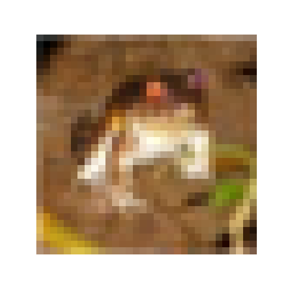

# Datasets

## Forewords

PyTorch provides an easy access to a lot of classical datasets: MNIST, ImageNet, COCO, CIFAR, Cityscapes, etc. In this page, I present briefly how to access these datasets.

For a complete information about this subject, please read the [official documentation](https://pytorch.org/docs/stable/torchvision/datasets.html) which is far superior to this page.

## CIFAR10 dataset

In the following example, I show how to access the CIFAR10 dataset. The datasets is downloaded in the folder `~/datasets` thanks to the use of the arguments `root` and `download=True`. The argument `train` allows to load separately the training set and the test set. In this section, I only show how to access CIFAR10 and display basic properties. Accessing data will be presented in the next section.

```python
import torch
import torchvision

# Directory where datasets will be stored
datasets_dir = '~/datasets'

# Training set
trainset = torchvision.datasets.CIFAR10(root=datasets_dir,
                                        train=True,
                                        download=True)

# Test set
testset = torchvision.datasets.CIFAR10(root=datasets_dir,
                                       train=False,
                                       download=True)

# Access datasets properties
train_shape = trainset.data.shape
test_shape = testset.data.shape
train_nb = train_shape[0]
test_nb = test_shape[0]
height = train_shape[1]
width = train_shape[2]
classes = trainset.classes
    
print("Training set size : %d" % train_nb)
print("Test set size     : %d" % test_nb)
print("Image size        : %d x %d" % (height, width))
print("List of classes")
for val in classes:
  print("- %s" % val)
```

After executing the previous sript, one should get the following output. Note that since I already had the CIFAR10 datasets (training and test) downloaded on my computer, the message _"Files already downloaded and verified"_ is displayed.

```
Files already downloaded and verified
Files already downloaded and verified
Training set size : 50000
Test set size     : 10000
Image size        : 32 x 32
List of classes
- airplane
- automobile
- bird
- cat
- deer
- dog
- frog
- horse
- ship
- truck
```

## Access images / labels

The images in the training and test sets can be accessed using the `data` attribute. This returns a Numpy array containing the entire dataset. The `targets` attributes contains the labels (index) of the images. We recall that CIFAR10 classify each image using 10 classes list above. The `classes` contains the conversion from a class index to a comprehensible string.

```python
import torch
import torchvision
import matplotlib.pyplot as plt

# Access the training set
datasets_dir = '~/datasets'
trainset = torchvision.datasets.CIFAR10(root=datasets_dir, train=True, download=True)

# Pick an image in the dataset
idx = 20

# Access the corresponding image label
label = trainset.targets[idx]
label_str = trainset.classes[label]
print("Image index : %d" % idx)
print("Image label : %d (%s)" % (label, label_str))

# Access the image and display it
img = trainset.data[idx,:,:,:]
print("Image type  : %s" % img.dtype)
plt.figure()
plt.imshow(img)
plt.axis('off')
plt.show()
```

The output is:

```
Files already downloaded and verified
Image index : 20
Image label : 4 (deer)
Image type  : uint8
```

And the displayed image is:


Note that the image is encoded on `uint8`.


## DataLoader

A convenient way to access the image is to use a `DataLoader`.

But first, let's see what changed in the CIFAR10 function. A `transform` function has been added. Indeed, the `DataLoader` requires to have access to images as `torch.Tensor`. By adding the transformation `transforms.ToTensor()`, we enseure that `trainset` will send the images in the correct format to the `DataLoader`. For a complete presentation of `transforms`, please read the [official documentation](https://pytorch.org/docs/stable/torchvision/transforms.html?highlight=transform).

The `DataLoader` takes care of loading the images as batches. In the example bellow, a batch will contain 4 images, the training data is not shuffled (just to have a consistent example here) et we are using 2 workers (number of subprocesses used for data loading).

To access the different bacthes, we create an `iter` object and call the `next()` method. The images and labels are `torch.Tensor` objects. To play with them, we can simply convert them into Numpy array.

One should pay attention to the shape of the batch. As shown bellow, the batch shape is (4, 3, 32, 32), corresponding respectively to the number of images in the batch, the number of channels, the height and the width of each image. To display properly the first image of the bacth, we first need to transpose it.

One last thing. At this point, images are encoded on `float32` (see output).

```python
import numpy as np
import torch
import torchvision
import torchvision.transforms as transforms
import matplotlib.pyplot as plt

# Access the training set
datasets_dir = '~/datasets'
trainset = torchvision.datasets.CIFAR10(root=datasets_dir,
                                        train=True,
                                        download=True,
                                        transform=transforms.ToTensor())

# Define the data loader
trainloader = torch.utils.data.DataLoader(trainset,
                                          batch_size=4,
                                          shuffle=False,
                                          num_workers=2)

# Access the first image batch
dataiter = iter(trainloader)
images, labels = dataiter.next()

# Convert the torch.Tensor into a Numpy array
images_np = images.numpy()
labels_np = labels.numpy()

# Print batch shape
print("Array shape : %s" % str(images_np.shape))
print("Array type  : %s" % images_np.dtype)

# Access the first image of the batch
idx = 0
img = np.transpose(images_np[idx,:,:,:], (1, 2, 0))
lbl = labels_np[idx]
print("Image index : %d" % idx)
print("Image label : %d (%s)" % (lbl, trainset.classes[lbl]))

# Display
plt.figure()
plt.imshow(img)
plt.axis('off')
plt.show()
```

The output is:

```
Files already downloaded and verified
Array shape : (4, 3, 32, 32)
Array type  : float32
Image index : 0
Image label : 6 (frog)
```

And the displayed image is:

