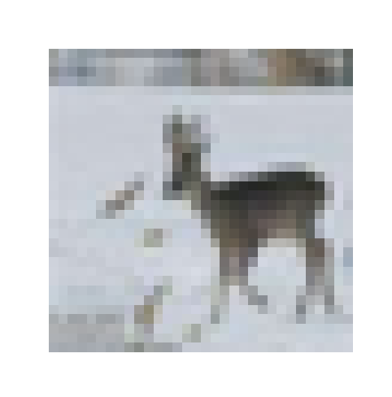

# Datasets

## Forewords

PyTorch provides an easy access to a lot of classical datasets: MNIST, ImageNet, COCO, CIFAR, Cityscapes, etc. In this page, I present briefly how to access these datasets.

For a complete information about this subject, please read the [official documentation](https://pytorch.org/docs/stable/torchvision/datasets.html) which is far superior to this page.

## CIFAR10 dataset

In the following example, I show how to access the CIFAR10 dataset. The datasets is downloaded in the folder `~/datasets` thanks to the use of the arguments `root` and `download=True`. The argument `train` allows to load separately the training set and the test set. In this section, I only show how to access CIFAR10 and display basic properties. Accessing data will be presented in the next section.

```python
import torch
import torchvision

# Directory where datasets will be stored
datasets_dir = '~/datasets'

# Training set
trainset = torchvision.datasets.CIFAR10(root=datasets_dir,
                                        train=True,
                                        download=True)

# Test set
testset = torchvision.datasets.CIFAR10(root=datasets_dir,
                                       train=False,
                                       download=True)

# Access datasets properties
train_shape = trainset.data.shape
test_shape = testset.data.shape
train_nb = train_shape[0]
test_nb = test_shape[0]
height = train_shape[1]
width = train_shape[2]
classes = trainset.classes
    
print("Training set size : %d" % train_nb)
print("Test set size     : %d" % test_nb)
print("Image size        : %d x %d" % (height, width))
print("List of classes")
for val in classes:
  print("- %s" % val)
```

After executing the previous sript, one should get the following output. Note that since I already had the CIFAR10 datasets (training and test) downloaded on my computer, the message _"Files already downloaded and verified"_ is displayed.

```
Files already downloaded and verified
Files already downloaded and verified
Training set size : 50000
Test set size     : 10000
Image size        : 32 x 32
List of classes
- airplane
- automobile
- bird
- cat
- deer
- dog
- frog
- horse
- ship
- truck
```

## Access CIFAR10 images / labels

The images in the training and test sets can be accessed using the `data` attribute. This returns a Numpy array containing the entire dataset. The `targets` attributes contains the labels (index) of the images. We recall that CIFAR10 classify each image using 10 classes list above. The `classes` contains the conversion from a class index to a comprehensible string.

```python
import torch
import torchvision
from PIL import Image

# Access the training set
datasets_dir = '~/datasets'
trainset = torchvision.datasets.CIFAR10(root=datasets_dir, train=True, download=True)

# Pick an image in the dataset
idx = 20

# Access the corresponding image label
label = trainset.targets[idx]
label_str = trainset.classes[label]
print("Index = %d" % idx)
print("Label = %d -> %s" % (label, label_str))

# Access the image and display it
img_np = trainset.data[idx,:,:,:]
img_pil = Image.fromarray(img_np)
img_pil.show()
```

The output is:

```
Files already downloaded and verified
Index = 20
Label = 4 -> deer
```

And the displayed image is:

