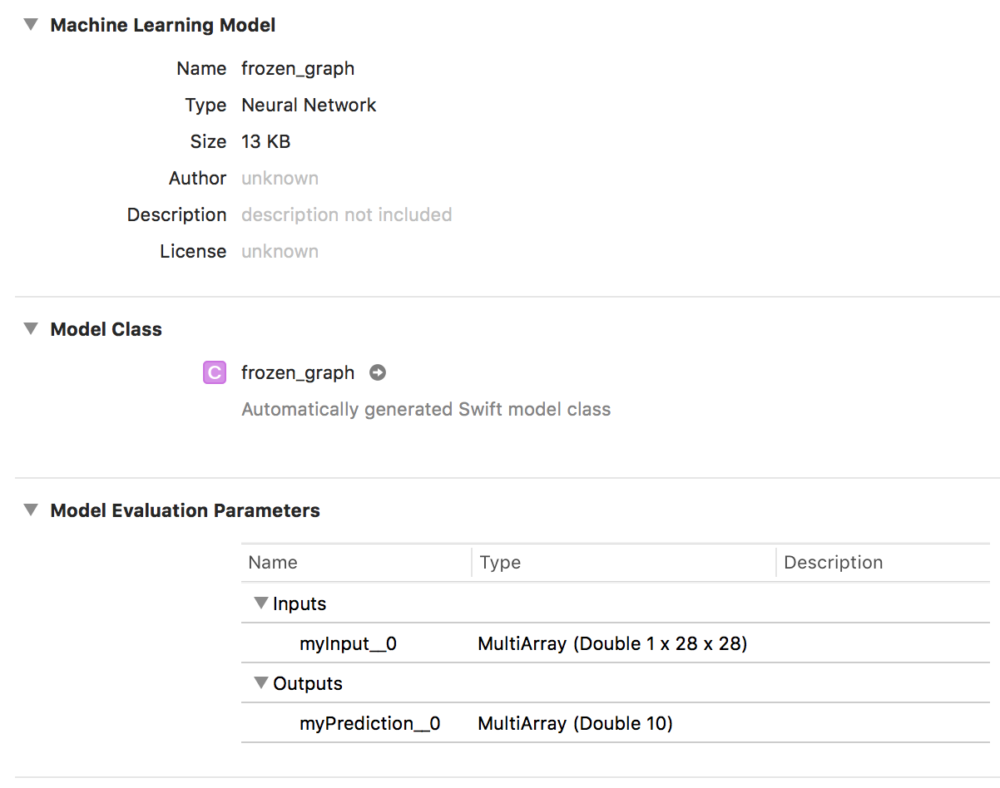
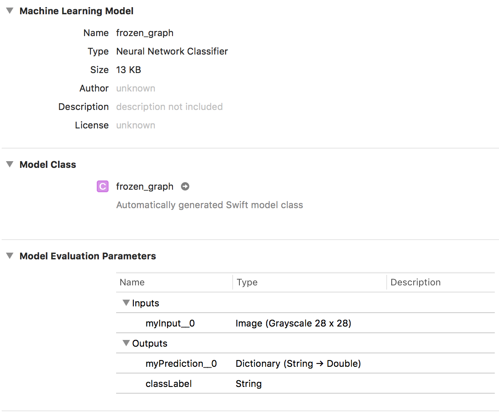

# Convert Frozen graph to CoreML model

We assume that we already have a frozen graph (see [here](export_frozen_graph.md)).

To convert this frozen graph into a CoreML Model, we use the tool [`TFCoreML`](https://github.com/tf-coreml/tf-coreml). All the details about how to install and use this tool is available on the [GitHub page](https://github.com/tf-coreml/tf-coreml).

Here is a simple example on how use this converter:


```python
import tfcoreml
 
# Path to the input frozen graph
tf_path = 'frozen_graph.pb'

# Path to the output CoreML Model
coreml_path = 'frozen_graph.mlmodel'

# Output tensor names
output_tensor_name = 'myPrediction:0'

# Convert the model
coreml_model = tfcoreml.convert(
        tf_model_path = tf_path,
        mlmodel_path = coreml_path)
```

The code is pretty self-explanatory. We need to provide the path to the input frozen graph as well as the path to the output CoreML Model (well, that seems normal). We also need to provide the name of the output tensor nodes.

When inported in XCode, the model appears like this. Note that the layer names as well as the input tensor shape corresponds to the one defined at training time (see [here](save_saved_model.md)).



It is possible to use more options to the converter. See bellow and example:

```python
import tfcoreml
 
# Path to the input frozen graph
tf_path = 'frozen_graph.pb'

# Path to the output CoreML Model
coreml_path = 'frozen_graph.mlmodel'

# Input and output tensor names
input_tensor_name = 'myInput:0'
output_tensor_name = 'myPrediction:0'

# Input tensor shape
input_tensor_shapes = {input_tensor_name: [1, 28, 28, 1]}

# Output labels
labels = ['0', '1', '2', '3', '4', '5', '6', '7', '8', '9']

# Convert the model
coreml_model = tfcoreml.convert(
        tf_model_path = tf_path,
        mlmodel_path = coreml_path,
        output_feature_names = [output_tensor_name],
        class_labels = labels,
        input_name_shape_dict = input_tensor_shapes,
        image_input_names = [input_tensor_name],
        red_bias = 0,
        green_bias = 0,
        blue_bias = 0,
        image_scale = 1.0/255.0)
```

In this use case, we define both the names of the input and output tensors. We also define the shape of the input tensor, which can be necessary for some frozen graphs.

The labels are mapped on the output index of the classifier. This allows for instance to get `dog` as the classifier output instead of a meaningless index. There is then no need to map the index to the actual meaning in the application, it's all done by the model.

One can also use the `red_bias `, `green_bias`, `blue_bias` and `image_scale` to apply pre-processing function to the input image.

Other options are availbale on the official documentation.

Using the options defined above, the model imported in XCode looks like this:



One can see that the model is not identical in XCode compared to the model previous imported.


# CoreML model quantization

OK, now we have a CoreML model. Good. Let's compress it by converting the weight to `float16`:

```python
import coremltools
 
# Input ML model path
coreml_path = 'frozen_graph.mlmodel'

# Output compressed ML model path
coreml_float16_path = 'frozen_graph_float16.mlmodel'

# Load model spec from input file
model_spec = coremltools.utils.load_spec(coreml_path)

# Convert the weights to float16
model_spec_float16 = coremltools.utils.convert_neural_network_spec_weights_to_fp16(model_spec)

# Save compressed model spec to output file
coremltools.utils.save_spec(model_spec_float16, coreml_float16_path)
```

Again, self-explanatory code, but just in case:

* Load the model 
* Compress the weights
* Save the model

The interesting this here is that the model is almost twice as light:

* `frozen_graph.mlmodel`: 13KB
* `frozen_graph_float16.mlmodel`: 7KB

On some experiements, this compression did not have any impact on both the accuracy and the processing time. Only the model size changes. Cool no?