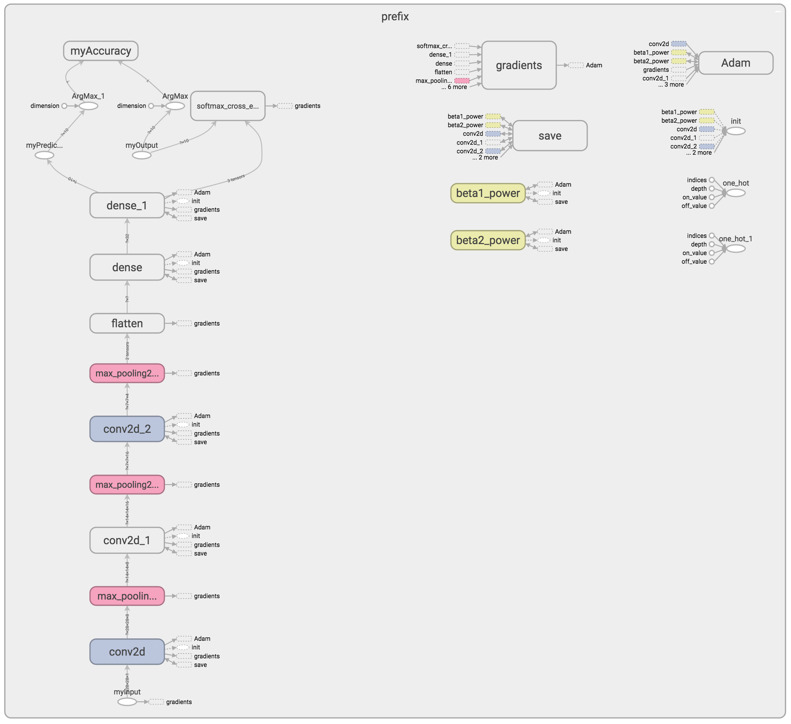
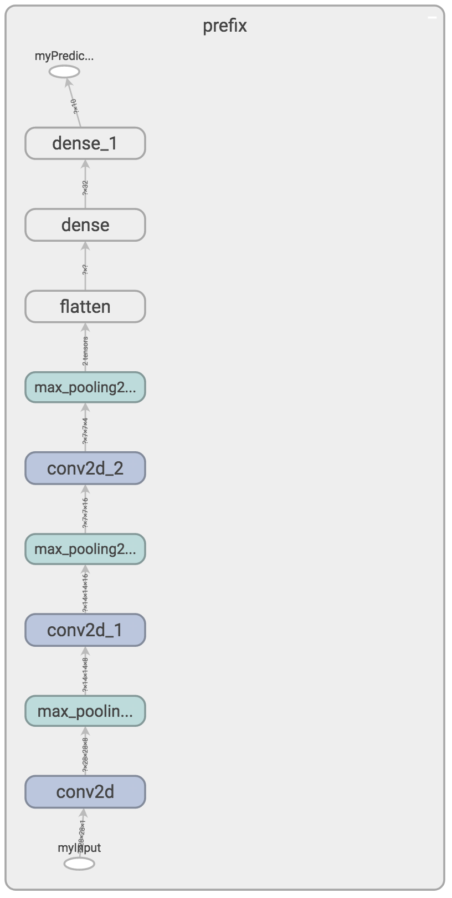

# Export frozen graph

To illustrate how to export a frozen graph, we assume that we have already trained a model and saved it using `saved_model`. Please check [here](save_saved_model.md) to see how to do that. This allows me to simplify the code.

Let's give an example with the following code:

```python
import tensorflow as tf
from tensorflow.python.platform import gfile

# Start TensorFlow session
with tf.Session() as sess:

    # Load the graph
    metagraph = tf.saved_model.loader.load(sess, ['serve'], 'backup')

    # Export the inference graph
    graph_def = sess.graph.as_graph_def()
    with gfile.GFile('graph.pb', 'wb') as f:
        f.write(graph_def.SerializeToString())

    # Remove useless nodes
    frozen_graph_def = tf.graph_util.convert_variables_to_constants(sess, graph_def, ['myPrediction'])

    # Export the inference frozen graph
    with tf.gfile.GFile('frozen_graph.pb', 'wb') as f:
        f.write(frozen_graph_def.SerializeToString())
```

What's done:

* The model already trained is loaded from the folder `backup`.
* The model is converted as a `graph_def`.
* Write the `graph_def` on disk.
* Create `frozen_graph_def` by removing all the nodes not linked to the `myPrediction` one.
* Write the `frozen_graph_def ` on disk.

If you check [here](save_saved_model.md), you can see that `myPrediction` was the name of the tensor allowing to access the model prediction. This name could be found using TensorBoard.


# Graphs properties

The two files have a very different size:

* `graph.pb` = 637 KB
* `frozen_graph.pb` = 16 KB

Bellow is the representation of `graph.pb`:



Bellow is the representation of `frozen_graph.pb `. By frezing the graph, we remove all the data only used at training time and keep only what's necessary at inference time. The graph becomes much simpler:




# Test frozen graph

Let's test the generated the frozen graph using the code bellow:

```python
import numpy as np
import tensorflow as tf
from tensorflow.python.platform import gfile

from mnist import load_mnist_dataset

# Load the MNIST dataset
train_images, train_labels, test_images, test_labels = load_mnist_dataset()

# Load the graph def
with tf.gfile.GFile('frozen_graph.pb', 'rb') as f:
    graph_def = tf.GraphDef()
    graph_def.ParseFromString(f.read())

# Create a default graph
with tf.Graph().as_default() as graph:

    # Import the graph
    tf.import_graph_def(graph_def, name='prefix')
    
    # Start the session
    with tf.Session(graph=graph) as sess:

        # Get the tensors
        x = sess.graph.get_tensor_by_name('prefix/myInput:0')
        y_pred = sess.graph.get_tensor_by_name('prefix/myPrediction:0')

        # Testing the 10 first test images
        print '\nTesting'
        for idx in range(10):
            groundtruth = test_labels[idx]
            prediction = np.argmax(sess.run(y_pred, feed_dict={x: [test_images[idx]]})[0])
            print '  Image %d, Groundtruth = %d, Prediction = %d' % (idx, groundtruth, prediction)
```

Basically, this is what is done:

* Load the MNIST dataset. See [here](mnist.md) for more information.
* Indentify the last checkpoint.
* Load the frozen graph. Use the name `prefix`, all node names will be prefixed by `prefix`.
* Access important the input and prediction nodes using the node names `prefix/myInput:0` and `prefix/myPrediction:0`. These names were defined at training time ([here](save_saved_model.md)) and prefixed by the graph name: `prefix`.
* Display the groundtruth and the prediction labels for the 10 first testing images.

The output logs should look like this:

```
Testing
  Image 0, Groundtruth = 7, Prediction = 7
  Image 1, Groundtruth = 2, Prediction = 2
  Image 2, Groundtruth = 1, Prediction = 1
  Image 3, Groundtruth = 0, Prediction = 0
  Image 4, Groundtruth = 4, Prediction = 4
  Image 5, Groundtruth = 1, Prediction = 1
  Image 6, Groundtruth = 4, Prediction = 4
  Image 7, Groundtruth = 9, Prediction = 9
  Image 8, Groundtruth = 5, Prediction = 5
  Image 9, Groundtruth = 9, Prediction = 9
```